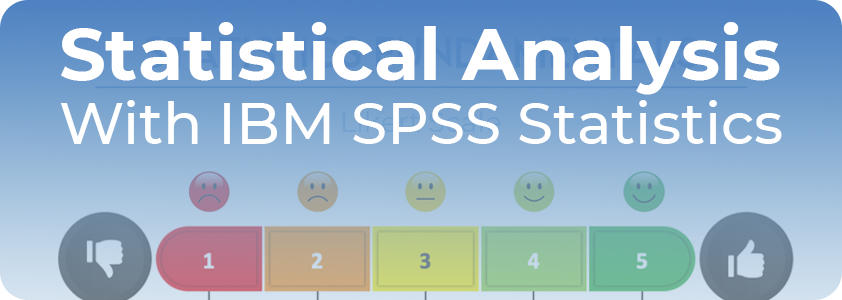

# Medical Data Analysis Project

This project utilizes IBM SPSS Statistics to analyze data related to medical professionals in Morocco for the year 2024. Conducted within the context of a Management Doctorate, the analysis focuses on evaluating trends and insights for a specific group of medical professionals, supporting informed decision-making in healthcare management.

## Techniques & Methods Used

The project included the use of various statistical techniques and methods to provide actionable insights and support data-driven decision-making. The main points are:

- Descriptive Statistics: Mean, Median, Standard Deviation, Variance, Quartiles
- Inferential Statistics: Normality Test, t-Test, Chi-Square Test, Correlation Analysis(Pearson, Spearman)

## Contact

[LinkedIn](https://www.linkedin.com/in/akhatarmourad/)
